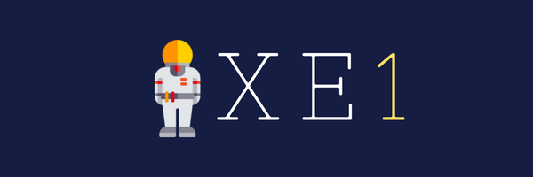
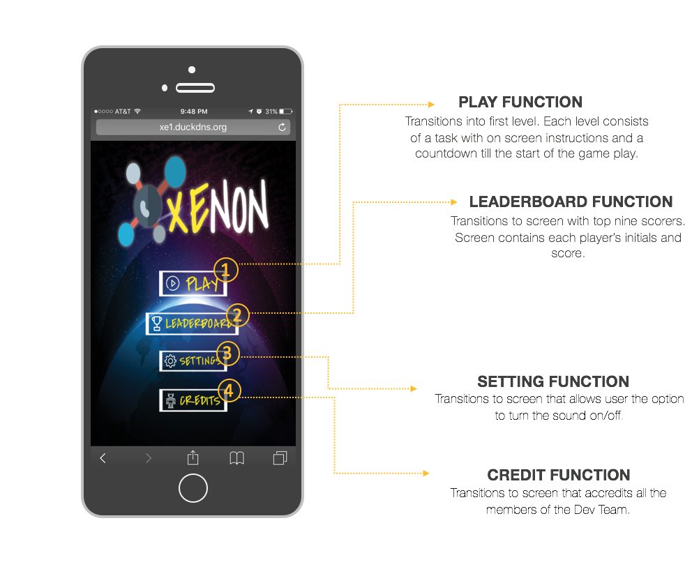

#  **Xenamorphs README**

##Project Name:  Xenon

<b><a href="#overview">Overview</a></b>
|
<b><a href="#features">Features</a></b>
|
<b><a href="#documentation">Documentation</a></b>
|
<b><a href="#credits">Credits</a></b>
|
<b><a href="#license">License</a></b>

##**Repo location**

[Our bitbucket](https://xenamorphs@bitbucket.org/cgunay-ggc/xenon.git)

## **Processing Tool**

Pivotal Tracker

## **Communication Tools**

[Slack Channel](https://ggc-dev.slack.com/messages/chemteam/details/)

## **Synopsis**

Xenon allows students to have the convince of learning on the go, any time of the day.  It’s availability on any mobile browser provides easy accessibility for all mobile drivers/platforms. The intent of Xenon puts the interest of students above everything else and continues to think of new convenient ways to reach bigger audiences and deliver new interesting ways to learn and retain information!

## **Code Example**

level1.prototype = {  
   
    //Main Phaser Create Function
  	create: function(){ 
        
        //Creating JSON-add another switch per file added.
        
        switchJSON = Math.floor(Math.random() * 5);
        
        if(switchJSON == 0){
            level_1_data = JSON.parse(this.game.cache.getText('level_1_JSON')); 
        }
        else if(switchJSON == 1){
            level_1_data = JSON.parse(this.game.cache.getText('level_1_JSON_series_2'));
        }  
        else if(switchJSON == 2){
            level_1_data = JSON.parse(this.game.cache.getText('level_1_JSON_series_3'));
        }
        else if(switchJSON == 3){
            level_1_data = JSON.parse(this.game.cache.getText('level_1_JSON_series_4'));
        }
        else if(switchJSON == 4){
            level_1_data = JSON.parse(this.game.cache.getText('level_1_JSON_series_5'));
        }

## **Installation**

No installation needed.  Simply visit the website [Xenon](www.TOBEANNOUNCED.com)

## **API Reference**
TBA
## **Tests**

TBA

=======================================================

## **Team Roles** (Cast 2)

###**Code Architecture/Lead Programmer** 
####(Framework, components, coding style)
* [Cat Windham](https://bitbucket.org/cwindham19/) **(Lead)**
* [Laura Arevalo](https://bitbucket.org/latrevalo/)
* [Chinelo Obiamalu](https://bitbucket.org/Chineloo/)
* [Charneaka Lewis](https://bitbucket.org/clewis20/)

###**UI/UX Design**
####(User Interface and User eXperience. Make mock UI designs and user-friendly navigation)
* [Chinelo Obiamalu](https://bitbucket.org/Chineloo/) **(Lead)**
* [Laura Arevalo](https://bitbucket.org/latrevalo/)
* [Charneaka Lewis](https://bitbucket.org/clewis20/)
###**Data Modeler**
####(Database, data files, server-client structure)
* [Charneaka Lewis](https://bitbucket.org/clewis20/) **(Lead)**
* [Chinelo Obiamalu](https://bitbucket.org/Chineloo/)
* [Laura Arevalo](https://bitbucket.org/latrevalo/)
* [Cat Windham](https://bitbucket.org/cwindham19/)
###**Team Manager/Client Liaison**
####(Sprint planning, and time accounting for the team. Communications, demos, and negotiations with client, what was done and planned to handle client's requirements)
* [Laura Arevalo](https://bitbucket.org/latrevalo/)

###**Documentation Lead**
####Setup documentation conventions for code and delegate work. Manage presentations, reports, and licensing documentation.
* [Laura Arevalo](https://bitbucket.org/latrevalo/) **(Lead)**
* [Cat Windham](https://bitbucket.org/cwindham19/)
###**Testing**
####Setup testing framework and conventions. Use continuous integration to test at each commit/push.
* [Charneaka Lewis](https://bitbucket.org/clewis20/)
**(Lead)**
* [Chinelo Obiamalu](https://bitbucket.org/Chineloo/)
    

## License

The properties of Xenon are protected under the following INTELLECTUAL PROPERTY AND LICENSING AGREEMENT:

[Xenamorphs Agreement](official-documentation/Final%20XE1%20Intellectual%20Property%20and%20Licensing%20Agreement.pdf)

##  FEATURES

<section>
    
   
</section>

##  DOCUMENTATION

Documentation process involves separate folders to accommodate the parties of:

[***DEVELOPER***](official-documentation/dev-docs)
|
[***CLIENT***](official-documentation/client-docs)
|
[***USER***](official-documentation/user-docs)

===============================================

##**PHASE 1 CAST**
This project could not have been possible without the following indivduals and their assigned roles:

* [Adele Francois](https://github.com/skyyfall007) :  ***Documentation Specialist & Project Manager***
* [Jawan Higgins](https://github.com/Jwork26)    :  ***Code Architect & Software Testing***
* [John Rose](https://github.com/jrose27)    :  ***Client Liaison & Lead Developer***
* [Adem Abafogi](https://github.com/aabafogi)    :  ***Database Modeler & UI/UX Design***
* [Dr. Cengiz Gunay](https://github.com/cengique)    :  ***Sponsor***
* Dr. Thomas Gluick:  ***Partner***

*game/marketing graphics produced/designed by Adele Francois

